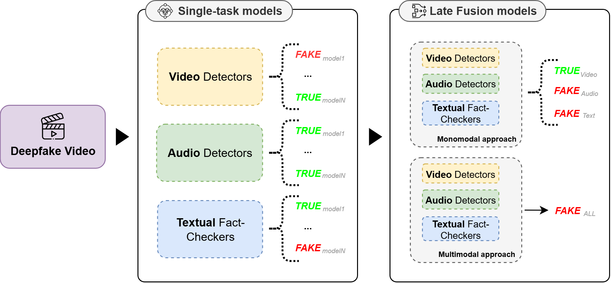
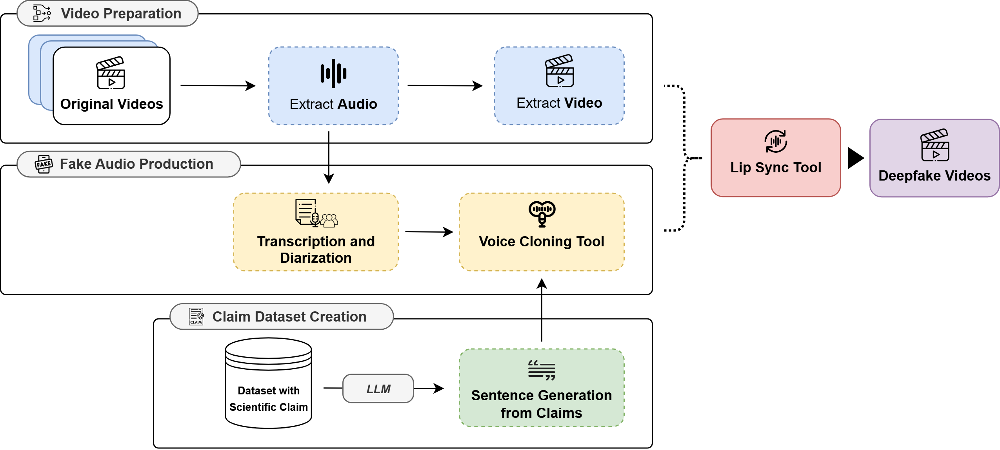
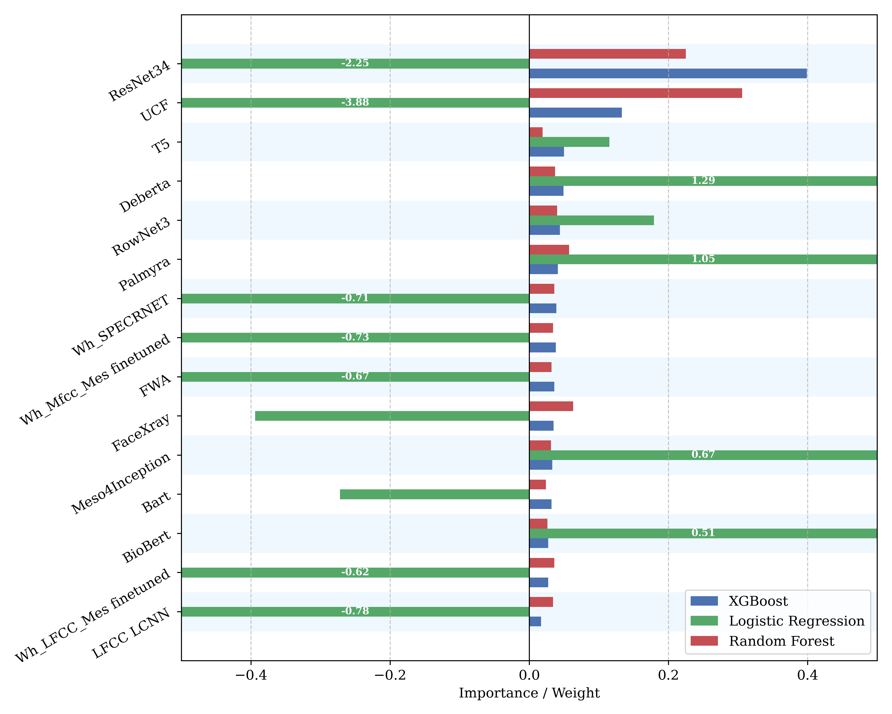

# 🩺⚡ SynthMed: Generating and Detecting Multimodal Deepfakes for Healthcare Communication

<div align="center">
    <a href="LICENSE.txt" target="_blank"></a>
    <a href="#" target="_blank"></a>
</div>
<hr>

Healthcare communication increasingly relies on digital platforms, creating new vulnerabilities for misinformation through sophisticated deepfake technologies. The proliferation of synthetic medical content poses serious risks to patient safety, public health policies, and trust in healthcare institutions.

We introduce **SynthMed**, a comprehensive framework for generating and detecting multimodal deepfakes specifically designed for healthcare communication scenarios. Our approach combines state-of-the-art generative models with advanced detection mechanisms using multimodal late-fusion strategies across video, audio, and textual fact-checking modalities.

Our evaluation demonstrates that **SynthMed** achieves robust detection capabilities through multimodal fusion, significantly outperforming single-modality approaches. These results highlight the framework's potential as both a research tool for understanding deepfake vulnerabilities and a defense mechanism against malicious synthetic healthcare content.

## 📊 Data Sources

- **[PUBHEALTH](https://github.com/neemakot/Health-Fact-Checking)**: Public health fact-checking dataset
- **[COVID-Fact](https://github.com/diegomontoya/covid19-misinformation)**: COVID-19 related claims and fact-checks
- **[SciFact](https://github.com/allenai/scifact)**: Scientific claim verification dataset
- **[HealthVer](https://github.com/sarrouti/HealthVer)**: Health-related claim verification corpus

The framework processes over 31k healthcare claims through multiple synthesis pipelines and evaluation protocols:
- **510 Generated Deepfakes**: Using advanced TTS/voice cloning and lip-sync technologies
- **40 In-the-Wild Deepfakes**: Web-sourced videos from Duke Reporters' Lab and YouTube (reported in [`datasets/HealthcareDeepfakesInTheWild.xlsx`](datasets/HealthcareDeepfakesInTheWild.xlsx))
- **150 Real Videos**: Authentic content for balanced evaluation
- **Balanced Dataset Splits**: Synthetic (D₁), in-the-wild (D₂), and combined (D₃) configurations

## 🛠️ Technologies Used

- **Video Generation & Detection**: 
  - **[VideoReTalking](https://github.com/OpenTalker/video-retalking)** for photorealistic lip-sync synthesis
  - **[DeepfakeBench](https://github.com/SCLBD/DeepfakeBench)** repository models for comprehensive detection
- **Audio Synthesis & Detection**: 
  - **OpenVoice, WhisperSpeech, OuteTTS** for voice cloning and TTS
  - **[deepfake-whisper-features](https://github.com/piotrkawa/deepfake-whisper-features)** for audio deepfake detection
- **Text Generation & Fact-Checking**: 
  - **PALMYRA-MED-70B-32K, LLAMA-3.1-NEMOTRON-70B-INSTRUCT** for claim elaboration (results in [`datasets/Dataset_Palmyra.csv`](datasets/Dataset_Palmyra.csv) and [`datasets/Dataset_llama.csv`](datasets/Dataset_llama.csv))
  - **Transformer-based models** (BERT variants, generative models) for fact verification (results in [`datasets/Elaborated_DatasetClaim_BART.csv`](datasets/Elaborated_DatasetClaim_BART.csv) and [`datasets/Elaborated_DatasetClaim_T5.csv`](datasets/Elaborated_DatasetClaim_T5.csv))
- **Multimodal Fusion**: **Logistic Regression, Random Forest, XGBoost** for late-fusion strategies
- **Speaker Processing**: **Whisper ASR, VAD, TitaNet** for speaker diarization and voice extraction

## 📑 Methodology

Our **SynthMed** framework operates through a dual-phase architecture addressing both generation and detection of healthcare deepfakes:

### Core Components

1. **Deepfake Generation Pipeline**:
   - **Claim Dataset Curation**: Merging multiple healthcare fact-checking datasets
   - **LLM-based Elaboration**: Converting claims into persuasive spoken sentences
   - **Synthetic Audio Production**: TTS/voice cloning with speaker diarization
   - **Video Lip-Sync**: Photorealistic mouth movement alignment

2. **Single-task Models Framework**:
   - **Video Forensics**: Spatial, geometric, and frequency-domain artifact analysis
   - **Audio Forensics**: TTS/voice-cloning detection and audio-visual synchrony
   - **Textual Fact-Checking**: Semantic veracity verification of spoken claims

3. **Late-Fusion Models Framework**:
   - **Meta-Classifier Engines**: Logistic Regression, Random Forest, XGBoost
   - **Monomodal Fusion**: Within-modality (video, audio, and text) ensemble of multiple detectors
   - **Multimodal Fusion**: Cross-modal integration using meta-classifiers
   - **Feature Importance Analysis**: Understanding modality contributions to decisions

4. **Evaluation Protocol**:
   - **Incremental Assessment**: Sequential video→audio→text analysis pipeline
   - **Cross-Domain Validation**: Testing across different distribution scenarios

### Architecture Overview



The system processes healthcare content through generation and detection pipelines, with late fusion combining complementary modality-specific signals for robust deepfake identification.



The generation workflow demonstrates the multi-stage approach for creating realistic synthetic healthcare communications from curated claims to final video output.



Late-fusion feature importance analysis reveals how different meta-classifiers (LR, RF, XGBoost) exploit distinct synergy patterns across video, audio, and text modalities.

## ✨ Key Features

- **Healthcare-Specific Pipeline**: Specialized framework for medical communication synthesis and detection
- **Multimodal Late Fusion**: Decision-level aggregation exploiting complementary error profiles
- **Comprehensive Benchmarking**: Integration of 15 video, 9 audio, and 6 text detection systems
- **Cross-Domain Evaluation**: Testing across synthetic, in-the-wild, and combined datasets
- **Interpretable Fusion**: Feature importance analysis revealing modality contributions
- **Scalable Architecture**: Subject-agnostic generation requiring no per-identity training
- **Comprehensive Benchmarking**: Systematic comparison across multiple detection paradigms

## 📁 Repository Structure

```
SynthMed/
├── README.md                       # This file
├── LICENSE.txt                     # CC BY-NC 4.0 license
├── code/                          # Implementation code (coming soon)
├── datasets/                      # Healthcare datasets and synthetic content
│   ├── Dataset_llama.csv         # Llama-generated elaborations
│   ├── Dataset_Palmyra.csv       # Palmyra-generated elaborations
│   ├── Elaborated_DatasetClaim_BART.csv
│   ├── Elaborated_DatasetClaim_T5.csv
│   └── HealthcareDeepfakesInTheWild.xlsx
└── img/                          # Methodology diagrams and visualizations
    ├── ISM_DeepfakeGeneration.png
    ├── ISM_LF_FeatureImportanceAnalysis.png
    └── ISM_Methodology.png
```

## 🏆 Experimental Results

Our comprehensive evaluation demonstrates significant advances in healthcare deepfake detection:

- **Multimodal Superiority**: Late fusion consistently outperformed single-modality approaches across all evaluation metrics
- **Cross-Domain Robustness**: Effective detection across synthetic and in-the-wild distribution scenarios
- **Complementary Modalities**: Each modality captures distinct artifact patterns, enabling synergistic detection
- **Meta-Classifier Performance**: XGBoost achieved optimal balance with ~89% accuracy and 0.84 AUC
- **Balanced Classification**: Strong performance on both authentic and synthetic content detection

The results confirm that multimodal integration provides a more reliable and robust approach for medical deepfake detection, demonstrating the importance of ensemble strategies in high-stakes healthcare communication scenarios.

## 🔧 Configuration Options

### Generation Models
- **Video Synthesis**: VideoReTalking for subject-agnostic lip-sync generation
- **Audio Synthesis**: OpenVoice (IVC), WhisperSpeech (TTS), OuteTTS (TTS) with controllable parameters
- **Text Elaboration**: PALMYRA-MED-70B-32K and LLAMA-3.1-NEMOTRON-70B-INSTRUCT

### Detection Strategies
- **Video Models**: Spatial, frequency-aware, and forensic detection architectures
- **Audio Models**: Feature-based approaches combining spectral and neural representations
- **Text Models**: Transformer-based fact-checkers and semantic verification systems

### Fusion Engines
- **Logistic Regression**: Interpretable linear combination for transparent decisions
- **Random Forest**: Ensemble approach robust to noisy modality scores
- **XGBoost**: Advanced gradient boosting for complex cross-modal pattern learning

## 📊 Evaluation Metrics

The framework includes comprehensive assessment tools:

- **Classification Metrics**: Precision, Recall, F1-score per class (True/Fake)
- **Macro-Averaged Metrics**: Macro-P, Macro-R, Macro-F1 for balanced evaluation
- **Threshold-Independent**: AUC, Equal Error Rate (EER), Accuracy
- **Cross-Validation**: Stratified splits ensuring class balance (70/15/15%)
- **Feature Importance**: Model-agnostic analysis of modality contributions
- **Domain Analysis**: Performance across synthetic (D₁), in-the-wild (D₂), and combined (D₃) scenarios

## 🚨 Ethical Considerations

This research addresses the critical need for deepfake detection in healthcare while acknowledging the dual-use nature of synthetic content generation:

- **Research Purpose Only**: All synthetic content generated solely for detection research
- **Responsible Disclosure**: Results shared to enhance healthcare cybersecurity awareness
- **Safeguards Required**: Clear labeling and guidelines for any data release
- **Privacy Protection**: All datasets ethically sourced with proper anonymization
- **Healthcare Context**: Special attention to patient safety and public health implications
- **Transparency**: Open methodology enabling validation and responsible deployment

## 🔬 Code Release

The complete implementation code including generation pipelines, detection models, and fusion frameworks will be released upon paper acceptance. The codebase will include:

- Multimodal deepfake generation scripts with healthcare-specific prompting
- Comprehensive detection model implementations and benchmarking tools
- Late-fusion framework with interpretability analysis
- Evaluation protocols and dataset preprocessing utilities
- Jupyter notebooks for reproducible experiments and analysis

## 🤝 Contributing

We welcome contributions to advance healthcare deepfake detection research! Please feel free to submit pull requests, report issues, or suggest improvements. All contributions should align with our ethical guidelines for responsible AI in healthcare.

👨‍💻 This project was developed by Mariano Barone, Francesco Di Serio, Antonio Romano, Giuseppe Riccio, Marco Postiglione, and Vincenzo Moscato at *University of Naples Federico II* – [PRAISE Lab - PICUS](https://github.com/PRAISELab-PicusLab/)

## 📜 License

This work is licensed under a
[Creative Commons Attribution-NonCommercial 4.0 International License][cc-by-nc].

[![CC BY-NC 4.0][cc-by-nc-image]][cc-by-nc]

[cc-by-nc]: https://creativecommons.org/licenses/by-nc/4.0/
[cc-by-nc-image]: https://licensebuttons.net/l/by-nc/4.0/88x31.png
[cc-by-nc-shield]: https://img.shields.io/badge/License-CC%20BY--NC%204.0-lightgrey.svg